Slide Link: https://drive.google.com/file/d/1CpfSPU_WYHSXEg_Yc3H02PZQ9Hsf9kny/view?usp=drive_link


This module dives into the fundamentals of relational database connections using foreign keys and constraints. You’ll learn how to work with different types of SQL joins—Inner, Left, Right, Full, Cross, and Natural—to combine data effectively across tables. To strengthen your skills, we’ve included hands-on SQL practice sessions so you can apply what you’ve learned in real scenarios.

## 47-1 Foreign Key Explained
- Foreign key is one tables primary key is set in another table and makes a relationship
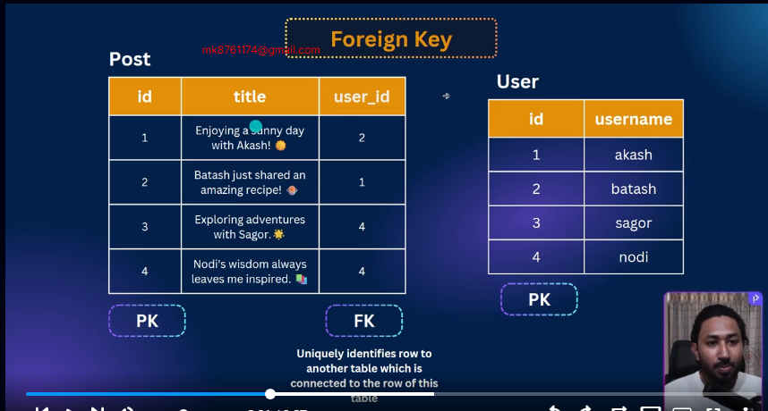
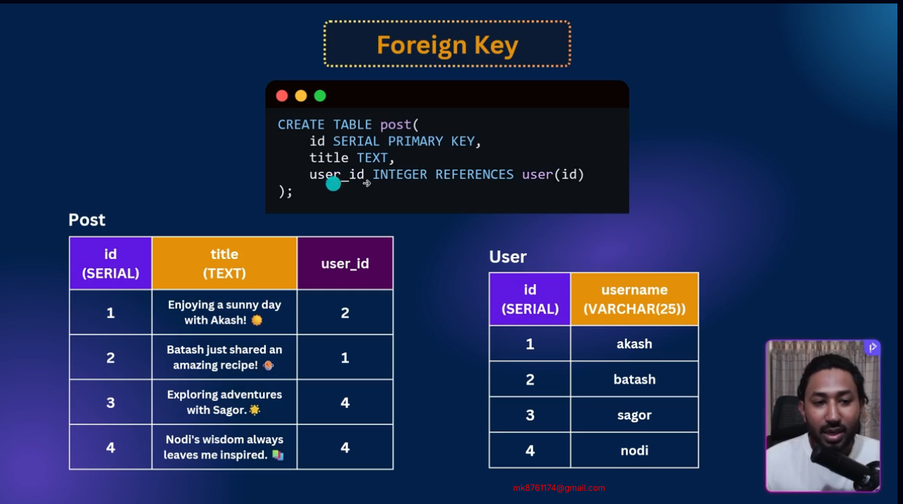
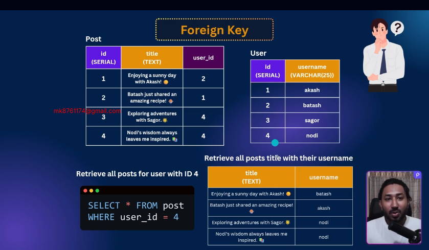

## 47-2 Adding Foreign Key Constraint
```sql
-- user table
create table users (
  id serial primary key,
  username varchar(25) not null
);


-- post table

create table posts (
  id serial primary key,
  title text not null,
  user_id int references "users"(id)
);


insert into users (username) values
('akash'),
('batash'),
('meghna'),
('jamuna')

insert into posts (title,user_id) values
('Enjoyin a sunny day  with akash',2),
('Batahs is the charing',1),
('Exploring adventure with sagor',4),
('you travelling in jamuna',4)
```

## 47-3 Understanding Inner Join
```sql
select * from post
 join users on users.id = post.user_id;
```

- ambiguous error of same id

```sql 
select id,title,username from post
 join users on users.id = post.user_id;
```

- to avoid this error we have to pass context 

```sql 
select post.id,title,username from post
 join users on users.id = post.user_id;
```

```sql 
select p.id, title,username from post as p
 join users as u on  p.user_id = u.id;
```

- this join ais called inner join as well 

```sql 
select p.id, title,username from post as p
inner join users as u on  p.user_id = u.id;
```

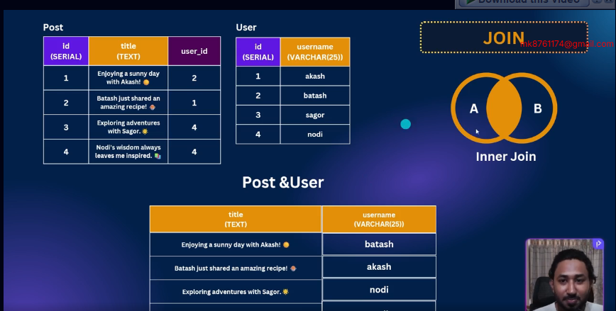

## 47-4 Left Join Made Easy
- type alias for shortcut
- in the inner join when user_id is null data not showing in output
- in the left join showing all data if user information is null data show as null
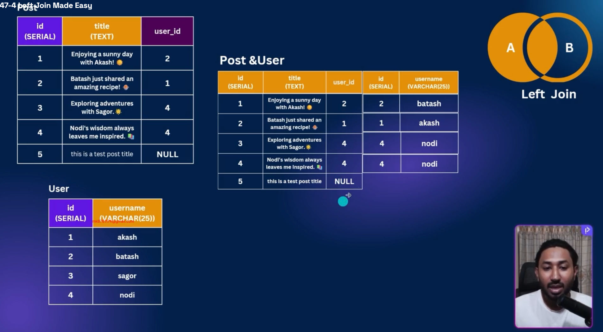
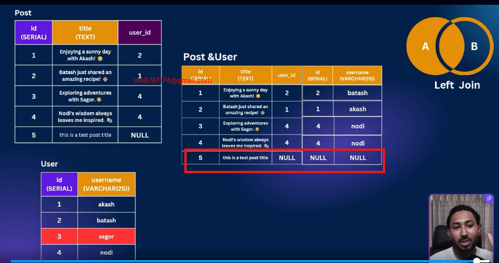
```sql
select  p.id, title , username from posts as p
join users as u on p.user_id = u.id

select  p.id, title , username from posts as p
join users as u on p.user_id = u.id


  
insert into posts (id,title) values
(5,'Enjoyin a sunny day  with akash');
```
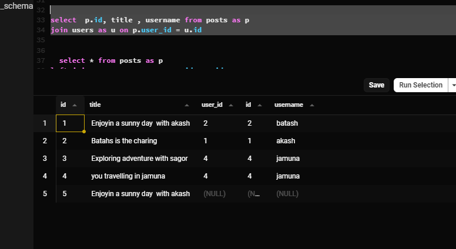
## 47-5 Right & Full Join

- right join its mean second table priority if user not any post showing his id and first table data showing null 
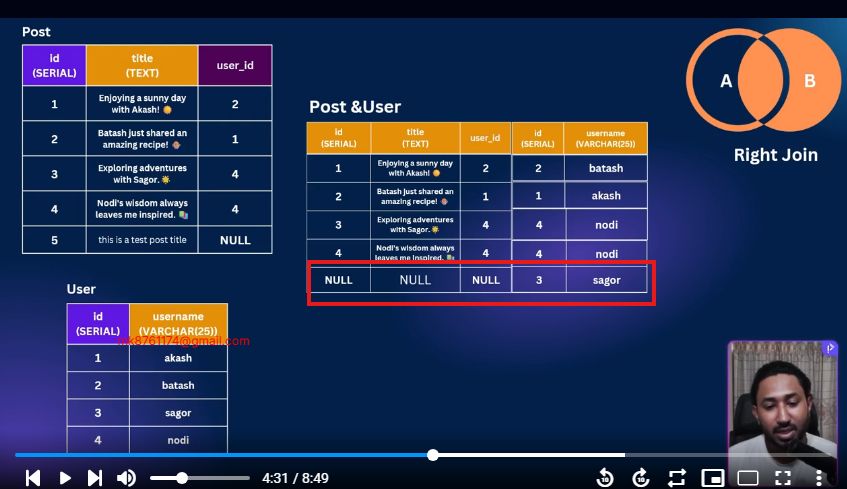
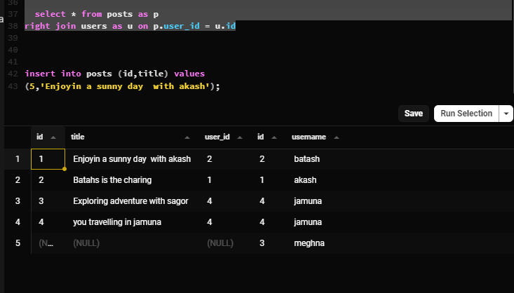
- full join he fill up all row if any row have no data he fill up in the null value but he put it all row table
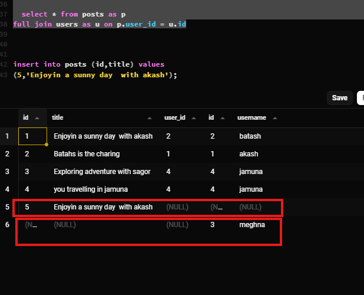

##  47-6 All Joins Overview (Cross & Natural too)
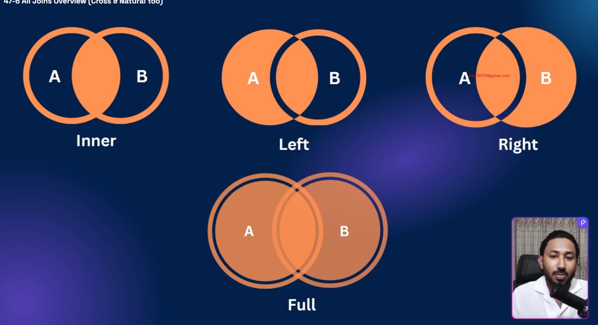
- is there cross join 
first table first row cross in second table first row
and again first table second row crossed in the second table first row same to same second row in the first table
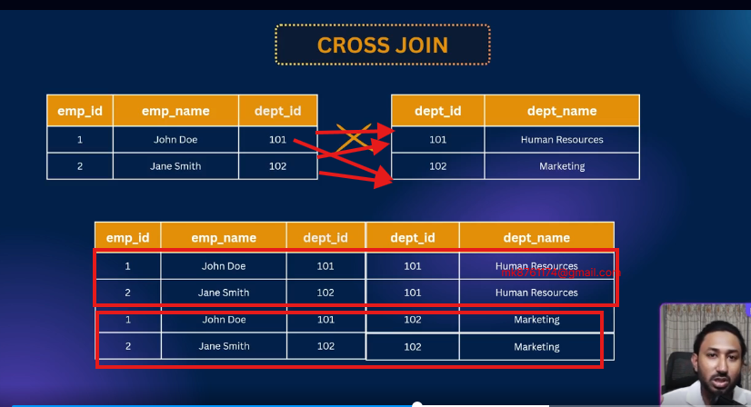
### natural join
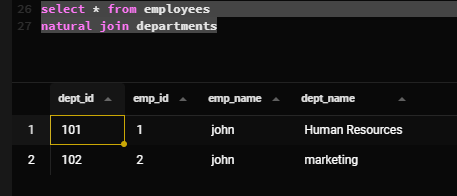
- who is id he matched he save  it
but if id not matched dont save it
- and same column if repeat he is not saved
- and must be added in the two table one common column otherwise he show error
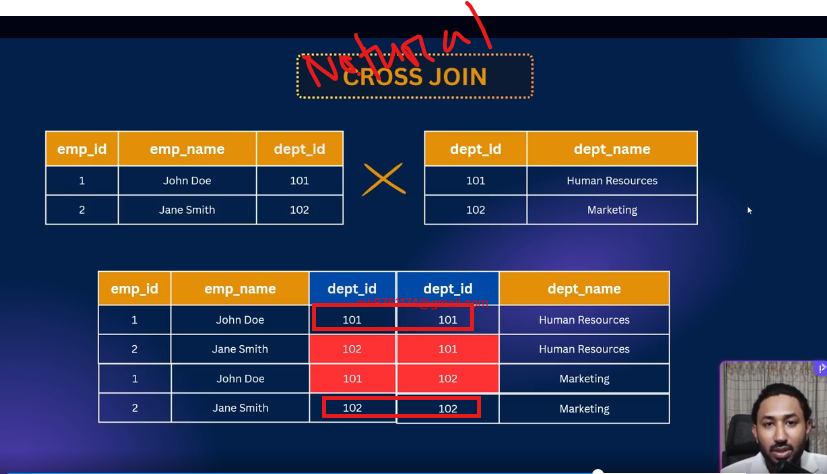

## 47-7 SQL Practice – Part 1
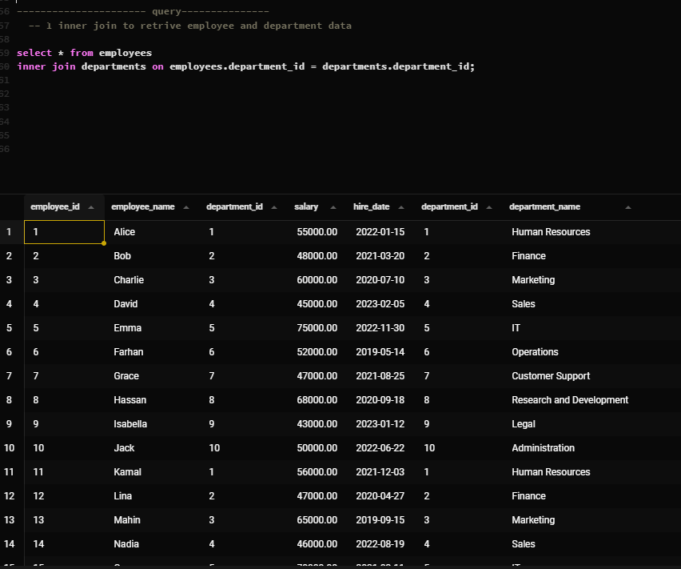
```sql
-- practice part-1
create table employees(
  employee_id serial primary key,
  employee_name varchar(50),
  department_id int references departments(department_id),
  salary decimal(10,2),
  hire_date date
);
-- data insert in employees table
INSERT INTO employees (employee_name, department_id, salary, hire_date) VALUES
('Alice',      1, 55000.00, '2022-01-15'),
('Bob',        2, 48000.00, '2021-03-20'),
('Charlie',    3, 60000.00, '2020-07-10'),
('David',      4, 45000.00, '2023-02-05'),
('Emma',       5, 75000.00, '2022-11-30'),
('Farhan',     6, 52000.00, '2019-05-14'),
('Grace',      7, 47000.00, '2021-08-25'),
('Hassan',     8, 68000.00, '2020-09-18'),
('Isabella',   9, 43000.00, '2023-01-12'),
('Jack',      10, 50000.00, '2022-06-22'),
('Kamal',      1, 56000.00, '2021-12-03'),
('Lina',       2, 47000.00, '2020-04-27'),
('Mahin',      3, 65000.00, '2019-09-15'),
('Nadia',      4, 46000.00, '2022-08-19'),
('Omar',       5, 70000.00, '2021-03-11'),
('Priya',      6, 52000.00, '2020-10-05'),
('Quinn',      7, 48000.00, '2023-04-01'),
('Rafi',       8, 69000.00, '2022-02-17'),
('Sadia',      9, 44000.00, '2019-11-23'),
('Tanvir',    10, 51000.00, '2021-07-29');

-- createing the departments table
create table departments(
  department_id serial primary key,
  department_name varchar(50)
)

  
  
-- 1 
-- data insert in departments

INSERT INTO departments (department_name) VALUES
('Human Resources'),
('Finance'),
('Marketing'),
('Sales'),
('IT'),
('Operations'),
('Customer Support'),
('Research and Development'),
('Legal'),
('Administration');


---------------------- query---------------
  -- 1 inner join to retrive employee and department data

select * from employees as e
inner join departments as d on e.department_id = d.department_id;
-- shortcut policy
select * from employees 
inner join departments using (department_id)
```


## 47-8 SQL Practice – Part 2

```sql


-- 2 show Department Name with Average slary
select department_name,round(avg (salary)) from employees 
inner join departments using (department_id)
group by department_name
  
-- 3 count Employees in Each Department
select department_name,count(*) from employees 
inner join departments using (department_id)
group by department_name
-- find the department name with the highest Average salary
select department_name,round(avg (salary)) as avg_salary from employees 
inner join departments using (department_id)
group by department_name order by avg_salary desc  limit 1
```
## 47-9 SQL Practice – Part 3
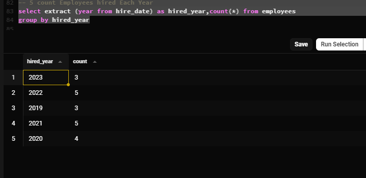
```sql
-- 5 count Employees hired Each Year
select extract (year from hire_date) as hired_year,count(*) from employees
group by hired_year
```