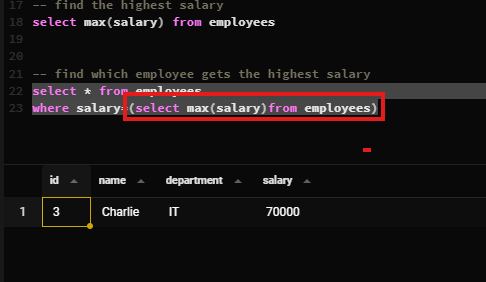
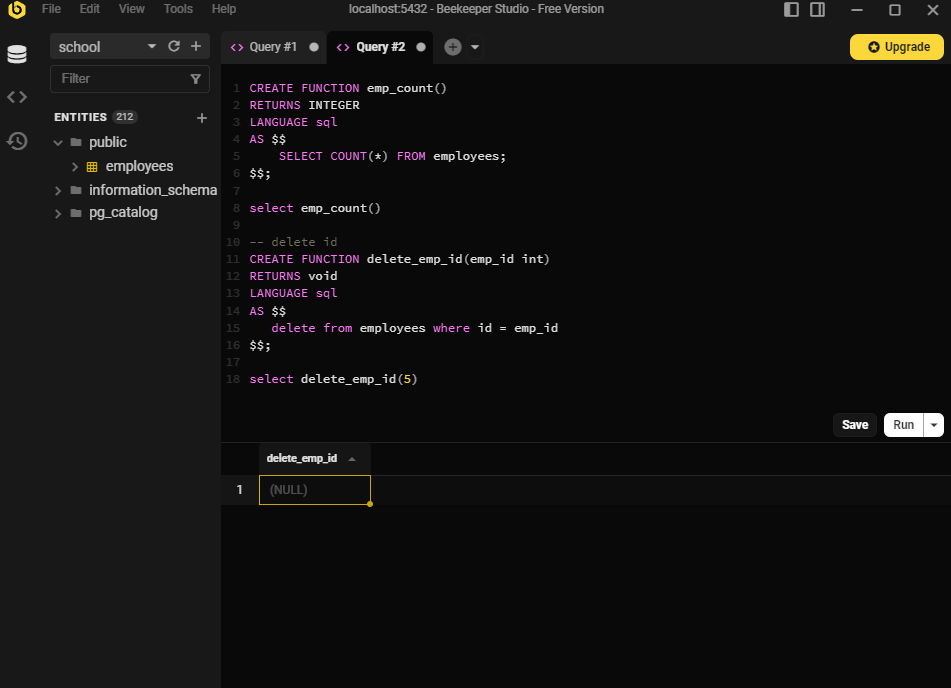

Slide Link: https://drive.google.com/file/d/1CpfSPU_WYHSXEg_Yc3H02PZQ9Hsf9kny/view?usp=drive_link


This module dives into the fundamentals of relational database connections using foreign keys and constraints. You’ll learn how to work with different types of SQL joins—Inner, Left, Right, Full, Cross, and Natural—to combine data effectively across tables. To strengthen your skills, we’ve included hands-on SQL practice sessions so you can apply what you’ve learned in real scenarios.

## 47-1 Foreign Key Explained
- Foreign key is one tables primary key is set in another table and makes a relationship


## 47-2 Adding Foreign Key Constraint
```sql
-- user table
create table users (
  id serial primary key,
  username varchar(25) not null
);


-- post table

create table posts (
  id serial primary key,
  title text not null,
  user_id int references "users"(id)
);


insert into users (username) values
('akash'),
('batash'),
('meghna'),
('jamuna')

insert into posts (title,user_id) values
('Enjoyin a sunny day  with akash',2),
('Batahs is the charing',1),
('Exploring adventure with sagor',4),
('you travelling in jamuna',4)
```

## 47-3 Understanding Inner Join
```sql
select * from post
 join users on users.id = post.user_id;
```

- ambiguous error of same id

```sql 
select id,title,username from post
 join users on users.id = post.user_id;
```

- to avoid this error we have to pass context 

```sql 
select post.id,title,username from post
 join users on users.id = post.user_id;
```

```sql 
select p.id, title,username from post as p
 join users as u on  p.user_id = u.id;
```

- this join ais called inner join as well 

```sql 
select p.id, title,username from post as p
inner join users as u on  p.user_id = u.id;
```


## 47-4 Left Join Made Easy
- type alias for shortcut
- in the inner join when user_id is null data not showing in output
- in the left join showing all data if user information is null data show as null


```sql
select  p.id, title , username from posts as p
join users as u on p.user_id = u.id

select  p.id, title , username from posts as p
join users as u on p.user_id = u.id


  
insert into posts (id,title) values
(5,'Enjoyin a sunny day  with akash');
```

## 47-5 Right & Full Join

- right join its mean second table priority if user not any post showing his id and first table data showing null 


- full join he fill up all row if any row have no data he fill up in the null value but he put it all row table


##  47-6 All Joins Overview (Cross & Natural too)

- is there cross join 
first table first row cross in second table first row
and again first table second row crossed in the second table first row same to same second row in the first table

### natural join

- who is id he matched he save  it
but if id not matched dont save it
- and same column if repeat he is not saved
- and must be added in the two table one common column otherwise he show error


## 47-7 SQL Practice – Part 1

```sql
-- practice part-1
create table employees(
  employee_id serial primary key,
  employee_name varchar(50),
  department_id int references departments(department_id),
  salary decimal(10,2),
  hire_date date
);
-- data insert in employees table
INSERT INTO employees (employee_name, department_id, salary, hire_date) VALUES
('Alice',      1, 55000.00, '2022-01-15'),
('Bob',        2, 48000.00, '2021-03-20'),
('Charlie',    3, 60000.00, '2020-07-10'),
('David',      4, 45000.00, '2023-02-05'),
('Emma',       5, 75000.00, '2022-11-30'),
('Farhan',     6, 52000.00, '2019-05-14'),
('Grace',      7, 47000.00, '2021-08-25'),
('Hassan',     8, 68000.00, '2020-09-18'),
('Isabella',   9, 43000.00, '2023-01-12'),
('Jack',      10, 50000.00, '2022-06-22'),
('Kamal',      1, 56000.00, '2021-12-03'),
('Lina',       2, 47000.00, '2020-04-27'),
('Mahin',      3, 65000.00, '2019-09-15'),
('Nadia',      4, 46000.00, '2022-08-19'),
('Omar',       5, 70000.00, '2021-03-11'),
('Priya',      6, 52000.00, '2020-10-05'),
('Quinn',      7, 48000.00, '2023-04-01'),
('Rafi',       8, 69000.00, '2022-02-17'),
('Sadia',      9, 44000.00, '2019-11-23'),
('Tanvir',    10, 51000.00, '2021-07-29');

-- createing the departments table
create table departments(
  department_id serial primary key,
  department_name varchar(50)
)

  
  
-- 1 
-- data insert in departments

INSERT INTO departments (department_name) VALUES
('Human Resources'),
('Finance'),
('Marketing'),
('Sales'),
('IT'),
('Operations'),
('Customer Support'),
('Research and Development'),
('Legal'),
('Administration');


---------------------- query---------------
  -- 1 inner join to retrive employee and department data

select * from employees as e
inner join departments as d on e.department_id = d.department_id;
-- shortcut policy
select * from employees 
inner join departments using (department_id)
```


## 47-8 SQL Practice – Part 2

```sql


-- 2 show Department Name with Average slary
select department_name,round(avg (salary)) from employees 
inner join departments using (department_id)
group by department_name
  
-- 3 count Employees in Each Department
select department_name,count(*) from employees 
inner join departments using (department_id)
group by department_name
-- find the department name with the highest Average salary
select department_name,round(avg (salary)) as avg_salary from employees 
inner join departments using (department_id)
group by department_name order by avg_salary desc  limit 1
```
## 47-9 SQL Practice – Part 3

```sql
-- 5 count Employees hired Each Year
select extract (year from hire_date) as hired_year,count(*) from employees
group by hired_year
```

## 47-10 Subquery Basics
- this is a subquery


```sql
-- sub query
create table employees(
  id serial primary key,
  name varchar(50),
  department varchar(50),
  salary int
)


INSERT INTO employees (name, department, salary) VALUES
('Alice',   'HR',        50000),
('Bob',     'Finance',   60000),
('Charlie', 'IT',        70000),
('Dina',    'Marketing', 55000),
('Evan',    'Sales',     65000);

-- find the highest salary
select max(salary) from employees


-- find which employee gets the highest salary
select * from employees
where salary=(select max(salary)from employees)

-- Find Employee Who earn more than the average salary

select * from employees
where salary > (select avg(salary)from employees)
-- name of the employee who gets the highest salary in Hr Department

select * from employees
where salary = (select max(salary) from employees  where department = 'HR')
```
## 47-11 Functions Explained

```sql
CREATE FUNCTION emp_count()
RETURNS INTEGER
LANGUAGE sql
AS $$
    SELECT COUNT(*) FROM employees;
$$;

select emp_count()

-- delete id
CREATE FUNCTION delete_emp_id(emp_id int)
RETURNS void
LANGUAGE sql
AS $$
   delete from employees where id = emp_id
$$;

select delete_emp_id(5)
```
## 47-12 Procedure Example 1 and 2 
```sql
SELECT count(*) FROM employees

CREATE Function emp_count()
RETURNS INT
LANGUAGE sql -- here can be plpgsql/plperl/PL/Python or etc for PROCEDURAL
AS
$$
-- here will be the function body
SELECT count(*) FROM employees
$$

SELECT emp_count();


CREATE or REPLACE function delete_emp()
RETURNS void
LANGUAGE SQL
AS
$$
DELETE FROM employees WHERE employee_id = 30;
$$

SELECT delete_emp();


CREATE OR replace FUNCTION delete_emp_by_id(p_emp_id INT)
RETURNS void
LANGUAGE SQL
AS
$$
DELETE FROM employees WHERE employee_id = p_emp_id;
$$

SELECT delete_emp_by_id(29);


CREATE PROCEDURE remove_emp()
LANGUAGE plpgsql
AS
$$
BEGIN
-- here we can write multiple sql queries or one single queries
-- here will exist the works/action that we want to do using procedure.
DELETE FROM employees WHERE employee_id = 28;
END
$$

CALL remove_emp()


CREATE PROCEDURE increase_low_salary(department_name VARCHAR(50))
LANGUAGE plpgsql
AS $$
DECLARE
    avg_salary NUMERIC;
BEGIN

    SELECT AVG(salary)
      INTO avg_salary
      FROM employees
     WHERE department = department_name;

    UPDATE employees
       SET salary = salary * 1.10
     WHERE department = department_name
       AND salary < avg_salary;
END;
$$;
SELECT avg(salary) FROM employees

call increase_low_salary('HR')
  
INSERT INTO employees (name, department, salary)
VALUES ('Haris', 'HR', 40000);
```
## 47-14 Trigger Example & 47-15 Writing Triggers
```sql

CREATE  function delete_emp_id(p_id int)
RETURNS void
LANGUAGE SQL
AS
$$
DELETE FROM employees WHERE employee_id =p_id;
$$


create table employee_logs(
  id serial primary key,
  emp_name varchar(50),
  action varchar(25),
  action_time timestamp default now()
)

create trigger save_employee_delete_logs
after delete on employees
for each row
execute function log_employee_deletion()


create function log_employee_deletion()
returns trigger
language plpgsql
as
$$
begin
  insert into employee_logs (emp_name,action) values(old.name,'delete');
return old;
  end;
$$

select delete_emp_id(6)

```

## 47-16 Indexing Explained
```sql
CREATE TABLE users (
    employee_no SERIAL PRIMARY KEY,
    birth_date DATE NOT NULL,
    first_name VARCHAR(14) NOT NULL,
    last_name VARCHAR(16) NOT NULL,
    gender CHAR(1) CHECK (gender IN ('M', 'F')),
    hire_date DATE NOT NULL
);

INSERT INTO users (birth_date, first_name, last_name, gender, hire_date)
VALUES
-- Original entries
('1993-01-02', 'Sarah', 'Chang', 'F', '2016-01-27'),
('1991-12-10', 'Deanna', 'Dixon', 'F', '2020-07-17'),
('1979-04-02', 'Walter', 'Howard', 'M', '2023-12-21'),
('1970-11-03', 'Brenda', 'Taylor', 'F', '2019-08-24'),
('2005-05-06', 'Victoria', 'Patel', 'F', '2017-11-19'),
('1985-07-14', 'James', 'Smith', 'M', '2015-03-01'),
('1990-09-21', 'Emily', 'Johnson', 'F', '2018-06-12'),
('1982-02-10', 'Robert', 'Williams', 'M', '2014-11-30'),
('1995-03-25', 'Linda', 'Brown', 'F', '2021-02-18'),
('1988-06-17', 'Michael', 'Jones', 'M', '2017-09-07'),
('1996-12-05', 'Jennifer', 'Garcia', 'F', '2022-10-25'),
('1975-08-29', 'William', 'Miller', 'M', '2013-05-14'),
('1983-11-19', 'Elizabeth', 'Davis', 'F', '2016-08-30'),
('1992-04-04', 'David', 'Rodriguez', 'M', '2019-01-10'),
('1987-01-08', 'Susan', 'Martinez', 'F', '2020-04-04'),
('1999-10-12', 'Daniel', 'Hernandez', 'M', '2021-12-15'),
('2001-06-30', 'Jessica', 'Lopez', 'F', '2023-03-22'),
('1973-09-16', 'Charles', 'Gonzalez', 'M', '2012-10-01'),
('1989-05-20', 'Karen', 'Wilson', 'F', '2015-07-09'),
('1994-02-28', 'Matthew', 'Anderson', 'M', '2018-01-27'),
('2000-11-11', 'Ashley', 'Thomas', 'F', '2022-06-04'),
('1997-03-07', 'Joseph', 'Moore', 'M', '2020-08-19'),
('1981-12-24', 'Amanda', 'Taylor', 'F', '2017-11-11'),
('1978-04-15', 'Andrew', 'Jackson', 'M', '2013-02-23');


TRUNCATE Table users

SELECT * FROM users;

EXPLAIN ANALYSE -- this will how the query is executed and show how much time is taken.
SELECT * from users WHERE last_name = 'Moore';
EXPLAIN ANALYSE -- this will how the query is executed and show how much time is taken.
SELECT * from employees WHERE last_name = 'Moore';

CREATE INDEX idx_employees_last_name
ON employees (last_name);
```